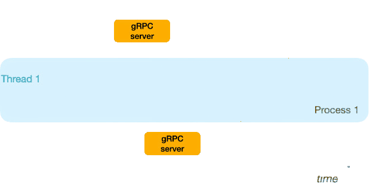

 

     
    

  
##    RPC & Microservices

  

Central repository for RPC and Microservices type backend projects.

  

 * Languages : Javascript, others.
 * Frameworks : Express, others.
 * Technologies : Nodejs, others.
 * Libraries : dotenv, cors, swagger, swagger-ui, nodemon, others.
 * Tools : Vsc, Git, Postman, others.
   
  
 
  

<!------Start Index----->

## Index 📜

 
 See 

  

#### 🗂️ Projects
* [gRPC protobuf API IPWHOIS.IO services](#grpc-protobuf-api-ipwhoisio-services-)

  

    
    
    
    
    
    
  

 

<!------Stop Index----->
  
  
 
  
 

<!------START gRPC IPWHOIS.IO------>

  
 ### gRPC protobuf API IPWHOIS.IO services. [🔝](#index-)

  

  
  
  
  
  
  

 

 ### Details

  
  

   <!------END gRPC IPWHOIS.IO------>

 
 
 
 
 
 

